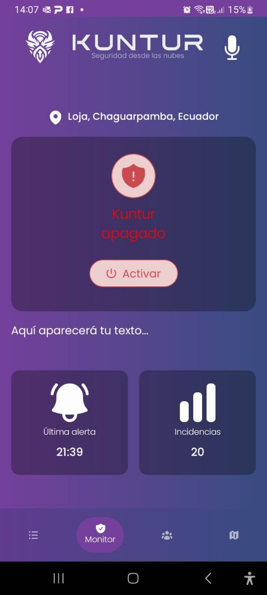

# Kuntur Detector


Aplicación Android desarrollada en **Kotlin** y **Java** usando **Jetpack Compose** para la interfaz de usuario. Permite convertir voz a texto y guardar los resultados en archivos locales. Integra llamadas a APIs usando **Retrofit** y **OkHttp**.

> ℹ️ Esta aplicación requiere permisos de micrófono y almacenamiento para funcionar correctamente.

## ✨ Características

- 🎤 Conversión de voz a texto
- 💾 Guardado de texto en archivos locales
- 🎨 Interfaz moderna con Jetpack Compose
- 🌐 Consumo de APIs REST con Retrofit y OkHttp
- 🌙 Soporte para temas claros y oscuros

## 🔧 Requisitos

- Android Studio Koala Feature Drop | 2024.1.2
- JDK 17+
- Gradle 8+
- Dispositivo o emulador Android 8.0+

## 🚀 Instalación

1. Clona el repositorio:
```bash
git clone https://github.com/tu_usuario/tu_repositorio.git
```

2. Abre el proyecto en Android Studio
3. Sincroniza las dependencias (Sync Now)

## 📦 Dependencias principales

```groovy
implementation 'androidx.compose.ui:ui:1.6.0'
implementation 'androidx.activity:activity-compose:1.8.0'
implementation 'com.squareup.okhttp3:okhttp:4.11.0'
implementation 'com.squareup.okhttp3:logging-interceptor:4.11.0'
implementation 'com.squareup.retrofit2:retrofit:2.9.0'
implementation 'com.squareup.retrofit2:converter-gson:2.9.0'
```

## 📱 Uso

1. **Iniciar grabación**: Pulsa el botón de micrófono para iniciar la conversión de voz a texto
2. **Editar resultado**: Edita el texto si es necesario
3. **Guardar texto**: Pulsa el botón de guardar para almacenar el texto en un archivo local

## 📁 Estructura del proyecto

```
/app
  /src
    /main
      /java     # Código fuente en Kotlin y Java
      /res      # Recursos (layouts, strings, drawables)
  build.gradle  # Configuración de dependencias
```

## 📷 Capturas de pantalla



## 📄 Licencia

Este proyecto está bajo la licencia MIT. Ver el archivo [LICENSE](LICENSE) para más detalles.

---

> ℹ️ ¿Dudas o sugerencias? Abre un issue en el repositorio.